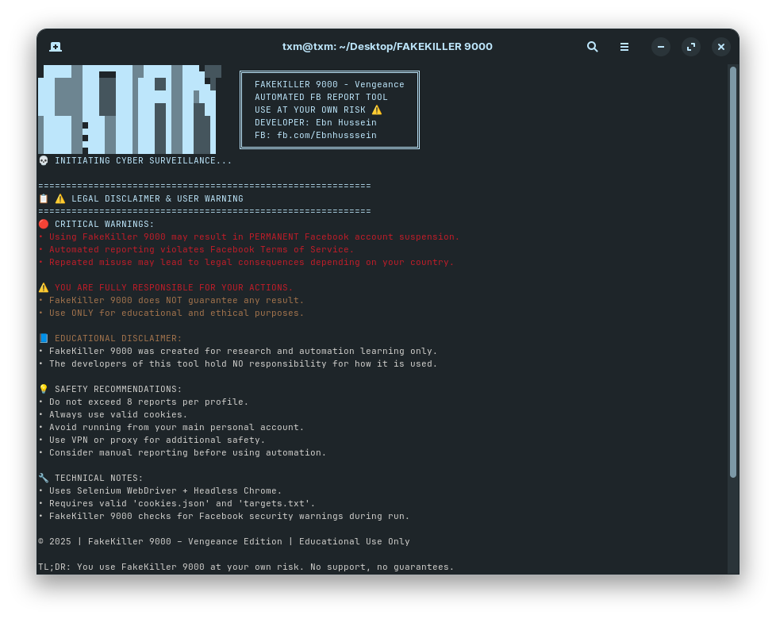
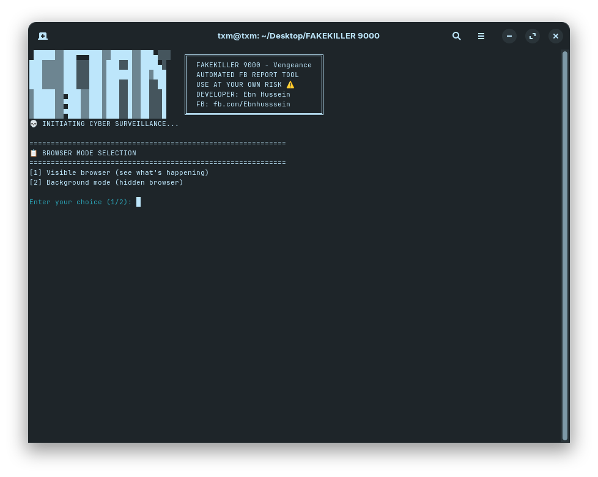
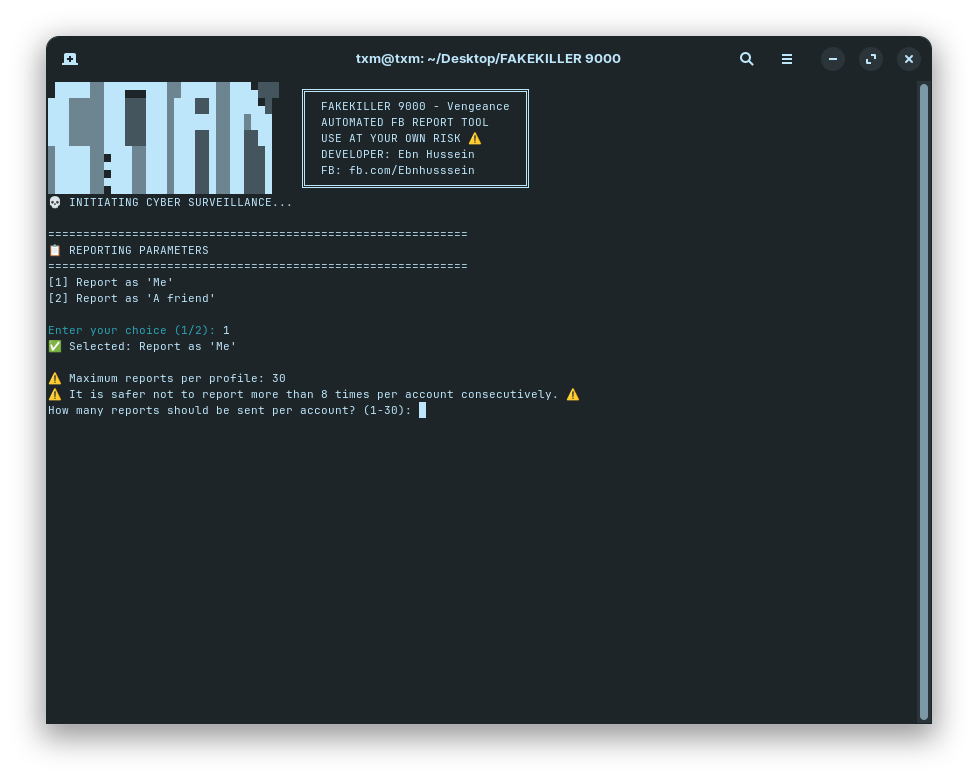

# 🔥 FAKEKILLER 9000


> ⚠️ **FOR EDUCATIONAL PURPOSES ONLY - USE AT YOUR OWN RISK**

FAKEKILLER 9000 is a sophisticated Facebook reporting automation tool featuring a sleek CLI interface and powerful automation features.

---

## 🎯 Features

- 🔄 **Automated Reporting** – Streamlined Facebook report automation  
- 🎨 **Professional CLI Interface** – Animated and interactive terminal UI  
- 🛡️ **Security Checks** – Detects Facebook security triggers  
- ⚡ **High Performance** – Optimized with retries and error handling  
- 📊 **Progress Tracking** – Real-time reporting stats  
- 🔒 **Secure Cookie Handling** – Safe storage for your Facebook cookies  
- 🎭 **Dual Modes** – Choose between headless or visible browser  

---

## ⚠️ DISCLAIMER

This tool is intended for **EDUCATIONAL PURPOSES ONLY**. Use it responsibly.

- You may get **permanently banned** from Facebook.
- This violates **Facebook’s Terms of Service**.
- The authors take **no responsibility** for your actions.
- Only use on **test accounts** or in **ethical environments**.

---

## 🚀 Quick Start

### ✅ 1. Prerequisites

- Python ≥ 3.7  
- Chrome or Chromium browser  
- A Facebook account and valid cookies  
- **Set Facebook language to English (US)** ⚠️

---

## 💾 Step 2: Installation

```bash
# Clone the repo
git clone https://github.com/yourusername/FAKEKILLER-9000.git
cd FAKEKILLER-9000

# Install dependencies
pip install -r requirements.txt
```

---

## 🔧 Configuration

### 🍪 Step 1: Install & Use EditThisCookie

To generate the cookies required for the script:

1. Install the extension:

   - Chrome: [EditThisCookie](https://chromewebstore.google.com/detail/editthiscookie-v3/ojfebgpkimhlhcblbalbfjblapadhbol)  
   - Firefox: [EditThisCookie](https://addons.mozilla.org/en-US/firefox/addon/editthiscookie-lastest-edition/)

2. Open Facebook in your browser and log in.

3. Click the **EditThisCookie** icon beside the address bar.

4. Click the **Export/Copy** button to copy your Facebook cookies.

5. Open the `cookies.json` file located in the project folder.

6. **Delete everything inside it**, and paste your cookies directly (in JSON format):

```json
[
  {"name": "c_user", "value": "123456789", "domain": ".facebook.com", "path": "/", "secure": true},
  {"name": "xs", "value": "abcdefg", "domain": ".facebook.com", "path": "/", "secure": true},
  {"name": "fr", "value": "example_value", "domain": ".facebook.com", "path": "/", "secure": true}
]
```

> 💡 Required cookies: `c_user`, `xs`, `fr`, `datr`, `sb`

---

### `targets.txt`

Add your target Facebook profiles (one per line):

```
https://www.facebook.com/target.profile1
https://www.facebook.com/target.profile2
```

---

### `my_friend_account.txt` (optional)

Use this if you want to report **as a friend**:

```
https://www.facebook.com/your.friend.profile
```

---

## 📁 Project Structure

```
FAKEKILLER-9000/
├── FAKEKILLER 9000.py        # Main script
├── cookies.json              # Facebook cookies (Paste your own)
├── targets.txt               # Target profiles list
├── my_friend_account.txt     # Friend account for reports
├── report_log.txt            # Log of script execution (auto-created)
├── requirements.txt          # Python dependencies
├── LICENSE                   # License info
└── README.md                 # This file
```

---

## 🎮 Running the Script

```bash
python "FAKEKILLER 9000.py"
```

You will be prompted to:

- 🔘 Choose browser mode: Headless or Visible


- 🎯 Choose reporting type: As Me or As a Friend

  
- 🧮 Enter number of reports per target
- ✅ Script will start automated reports

📝 The script **automatically creates `report_log.txt`** in the same directory to track all actions and statuses.
```
⚠️ Make sure your Facebook account language is set to English (US)
📶 Use VPN or proxy to protect your IP if needed
```
---

## 📊 Logging

All reporting activity is saved automatically in `report_log.txt`, for example:

```
2025-07-17 14:05:12 | https://facebook.com/example | Reported
```

---

## 🔍 Troubleshooting

| Problem                    | Solution                                |
|---------------------------|------------------------------------------|
| ❌ ChromeDriver Error      | Auto-installs if missing                |
| ❌ Invalid Cookies         | Refresh your `cookies.json`             |
| ⚠️ Security Check         | Manual Facebook verification required   |
| ❌ Target Not Found        | Check format in `targets.txt`           |
| ⚠️ Facebook not English    | Change Facebook language to English     |

---

## 🧪 Performance

- 💨 **Fast** execution  
- 🧠 **Smart retries**  
- 📉 **Low resource use**  
- ✅ **Stable operation**

---

## 🔐 Security Tips

- Use **VPN or proxy** to protect your IP  
- Avoid using your **main account**  
- Respect **Facebook rate limits**  
- Don’t share your cookies publicly  
- Delete logs after use if needed


---

## 📝 Legal

- Use responsibly under **local laws**  
- You are **responsible** for your actions  
- This tool is for **educational, non-commercial use only**  
- No liability, no warranty — see `LICENSE.md`

---

## 🤝 Credits & Support

- 👨‍💻 Developer: **Ebn Hussein**  
- 🌐 Facebook: [fb.com/Ebnhusssein](https://www.facebook.com/Ebnhusssein)  
- 📦 Version: **Vengeance Edition 2025**

---

## ☕ Support the Project

If you appreciate this tool, you can support the developer:

- 💬 Telegram: [t.me/ebnhussein](https://t.me/Ebn_hussein)
- ⭐ Star the repository to show support!
- 📣 Share the tool with friends who learn automation
- 🇵🇸 **Donate to Gaza Relief via PayPal:**  
  [Donate to Connecting Gaza](https://www.paypal.com/donate/?hosted_button_id=23RZ8GYXVMKZU) – your contribution will go directly towards **humanitarian aid in Gaza**

Your support helps sustain educational tools *and* provides real-world impact in Gaza.

---

> _"With great power comes great responsibility"_ 🕸️

---

## 🇵🇸 Free Palestine

**🇵🇸 Free Palestine – We stand with justice.**
